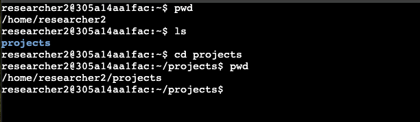
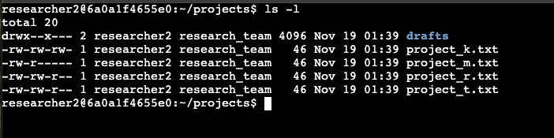
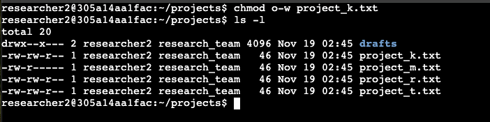
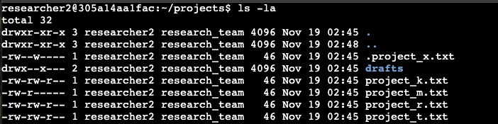

# 🐧 Linux File Permissions & Access Control  
**Focus:** Linux Administration · Access Control · Security Hardening

---

## 📌 Project Description
Using the Linux command line, file and directory permissions were examined and modified to ensure that users and groups have **appropriate levels of access**. Proper permission management helps limit organizational risk by reducing unauthorized access and minimizing the attack surface.

---

## 📂 Check File and Directory Details
The first step was verifying the current working directory and navigating to the target project directory. This confirms the context before performing any permission analysis or changes.

---

## 🔐 Describe the Permissions String
The permissions string was analyzed to determine:
- File type (directory vs file)
- User, group, and other permissions
- File ownership and group association

From the output, it was confirmed that:
- The directory contained a single authorized user
- Files were owned by the appropriate group
- Permissions were clearly defined for user, group, and others

---

## ✏️ Change File Permissions
Due to updated access control requirements, the owner group was no longer permitted to have write access to a specific file. The `chmod` command was used to remove write permissions and align with policy.

---

## 👁️ Identify Hidden Files
Hidden files within the project directory were identified to ensure no sensitive files were overlooked during the review process.

---

## 🔒 Restrict Permissions on a Hidden File
Additional permission changes were applied to a hidden file to ensure it had **read-only access**, preventing unauthorized modification.

This step demonstrates careful review of both visible and hidden assets within a directory.

---

## 📁 Change Directory Permissions
Directory permissions were reviewed to confirm that group members no longer had execute access where it was not required. Removing unnecessary execute permissions helps prevent unauthorized directory traversal and supports the principle of least privilege.

---

## 🎯 Key Skills Demonstrated
- Linux command-line navigation  
- File and directory permission analysis  
- Use of `chmod` for access control  
- Identification and handling of hidden files  
- Security-focused system hardening  

---

## 📚 Summary
Reviewing and adjusting file and directory permissions is a **continuous security task**. Regular permission audits—especially during staffing or role changes—help reduce risk from both internal and external threat actors by enforcing the principle of least privilege.
